# Lucho Party Game - Flow & UX Frames

## App Flow Diagram

```mermaid
flowchart TD
    Start([App Launch]) --> CreateOrJoin{New Session<br/>or Join?}
    
    CreateOrJoin -->|Create| CreateSession[Create Session<br/>Generate QR Code]
    CreateOrJoin -->|Join| ScanQR[Scan QR Code]
    
    CreateSession --> EnterName[Enter Screen Name]
    ScanQR --> EnterName
    
    EnterName --> Lobby[Session Lobby<br/>Show QR for others to join<br/>Wait for players]
    
    Lobby --> StartGame{Host starts<br/>game?}
    StartGame -->|No| Lobby
    StartGame -->|Yes| SelectActor[Random: Select Actor]
    
    SelectActor --> ActorChoosesScene[Actor Chooses Scene<br/>from list]
    
    ActorChoosesScene --> SelectDirector[Random: Select Director]
    
    SelectDirector --> DirectorChoosesStyle[Director Chooses<br/>Director Style]
    
    DirectorChoosesStyle --> PreRoundScreen[All Players See:<br/>- Actor name<br/>- Scene chosen<br/>- Director name<br/>- Style chosen]
    
    PreRoundScreen --> ActorDirectorReady{Actor & Director<br/>press START?}
    
    ActorDirectorReady -->|Waiting| PreRoundScreen
    ActorDirectorReady -->|Both Ready| RoundActive[Round Active<br/>5 Minute Timer<br/>Actor performs<br/>Director directs]
    
    RoundActive --> RoundEnd[Round Ends!<br/>Big Screen Notification]
    
    RoundEnd --> RatingScreen{Player Role?}
    
    RatingScreen -->|Viewer| RatePerformance[Rate Performance<br/>1-5 Stars]
    RatingScreen -->|Actor/Director| WaitForRatings[Wait for Ratings]
    
    RatePerformance --> ShowScores[Show Scores<br/>Individual scores<br/>Cumulative totals]
    WaitForRatings --> ShowScores
    
    ShowScores --> NextRound[Continue to<br/>Next Round?<br/>Yes/No]
    
    NextRound -->|Timeout or All Voted| CheckVotes{Enough<br/>Yes votes?}
    
    CheckVotes -->|Yes| SelectActor
    CheckVotes -->|No| GameOver[Game Over<br/>Final Scores]
    
    GameOver --> End([Exit or New Session])
```



## Detailed UX Frames

### 1. Session Creation/Join
**Frame: Landing Screen**
```
┌─────────────────────────────────┐
│     LUCHO PARTY GAME           │
│                                 │
│   ┌─────────────────────┐      │
│   │   CREATE SESSION    │      │
│   └─────────────────────┘      │
│                                 │
│   ┌─────────────────────┐      │
│   │    JOIN SESSION     │      │
│   └─────────────────────┘      │
│                                 │
└─────────────────────────────────┘
```

### 2. QR Code Display (Creator)
**Frame: Session Created**
```
┌─────────────────────────────────┐
│     SESSION CREATED!            │
│                                 │
│       ┌─────────────┐           │
│       │             │           │
│       │   QR CODE   │           │
│       │             │           │
│       └─────────────┘           │
│                                 │
│   Show this to other players    │
│   to let them join!             │
│                                 │
│   Session ID: ABC123            │
└─────────────────────────────────┘
```

### 3. Enter Screen Name
**Frame: Name Entry**
```
┌─────────────────────────────────┐
│     CHOOSE YOUR NAME            │
│                                 │
│   ┌─────────────────────────┐  │
│   │ Enter screen name...    │  │
│   └─────────────────────────┘  │
│                                 │
│   ┌─────────────────────┐      │
│   │      CONTINUE       │      │
│   └─────────────────────┘      │
│                                 │
└─────────────────────────────────┘
```

### 4. Lobby
**Frame: Waiting Room**
```
┌─────────────────────────────────┐
│     SESSION LOBBY               │
│                                 │
│   Players in session:           │
│   • Alice                       │
│   • Bob                         │
│   • Charlie                     │
│   • You (Dana)                  │
│                                 │
│   ┌───────────┐                 │
│   │  QR CODE  │  ← Share!       │
│   └───────────┘                 │
│                                 │
│   [START GAME] (host only)      │
└─────────────────────────────────┘
```

### 5. Actor Chooses Scene
**Frame: Actor's Turn**
```
┌─────────────────────────────────┐
│  YOU ARE THE ACTOR!             │
│                                 │
│  Choose your scene:             │
│                                 │
│  ○ Romeo & Juliet - Balcony     │
│  ○ Hamlet - To be or not to be  │
│  ○ Macbeth - Dagger speech      │
│  ○ Star Wars - I am your father │
│  ○ The Godfather - Offer scene  │
│                                 │
│   ┌─────────────────────┐      │
│   │      CONFIRM        │      │
│   └─────────────────────┘      │
└─────────────────────────────────┘
```

### 6. Director Chooses Style
**Frame: Director's Turn**
```
┌─────────────────────────────────┐
│  YOU ARE THE DIRECTOR!          │
│                                 │
│  Direct the scene as:           │
│                                 │
│  ○ Quentin Tarantino            │
│  ○ Wes Anderson                 │
│  ○ Christopher Nolan            │
│  ○ Tim Burton                   │
│  ○ Alfred Hitchcock             │
│                                 │
│   ┌─────────────────────┐      │
│   │      CONFIRM        │      │
│   └─────────────────────┘      │
└─────────────────────────────────┘
```

### 7. Pre-Round Screen (All Players)
**Frame: Round Info**
```
┌─────────────────────────────────┐
│     ROUND READY!                │
│                                 │
│  🎭 Actor: Alice                │
│     Scene: Romeo & Juliet       │
│            Balcony Scene        │
│                                 │
│  🎬 Director: Bob               │
│     Style: Wes Anderson         │
│                                 │
│  Waiting for Actor & Director   │
│  to start...                    │
│                                 │
└─────────────────────────────────┘
```

### 8. Pre-Round Screen (Actor/Director)
**Frame: Ready to Start**
```
┌─────────────────────────────────┐
│     ROUND READY!                │
│                                 │
│  🎭 Actor: Alice (YOU)          │
│     Scene: Romeo & Juliet       │
│            Balcony Scene        │
│                                 │
│  🎬 Director: Bob               │
│     Style: Wes Anderson         │
│                                 │
│   ┌─────────────────────────┐  │
│   │      ▶ START ROUND      │  │
│   └─────────────────────────┘  │
│                                 │
└─────────────────────────────────┘
```

### 9. Active Round
**Frame: Performance in Progress**
```
┌─────────────────────────────────┐
│     🎬 ROUND IN PROGRESS        │
│                                 │
│         ⏱️ 3:47                  │
│                                 │
│  Actor: Alice                   │
│  Director: Bob (Wes Anderson)   │
│  Scene: Romeo & Juliet          │
│                                 │
│  🎭 Performance happening...    │
│                                 │
│  (Viewers watch silently)       │
│                                 │
└─────────────────────────────────┘
```

### 10. Round End
**Frame: Time's Up!**
```
┌─────────────────────────────────┐
│                                 │
│        🎉 TIME'S UP! 🎉         │
│                                 │
│     Great performance!          │
│                                 │
│     Now it's time to rate...    │
│                                 │
│                                 │
└─────────────────────────────────┘
```

### 11. Rating Screen (Viewers)
**Frame: Rate Performance**
```
┌─────────────────────────────────┐
│     RATE THE PERFORMANCE        │
│                                 │
│  Actor: Alice                   │
│  Director: Bob                  │
│                                 │
│  How was it?                    │
│                                 │
│    ⭐ ⭐ ⭐ ⭐ ⭐                  │
│    1  2  3  4  5                │
│                                 │
│   ┌─────────────────────┐      │
│   │      SUBMIT         │      │
│   └─────────────────────┘      │
└─────────────────────────────────┘
```

### 12. Scores Display
**Frame: Results**
```
┌─────────────────────────────────┐
│     ROUND SCORES                │
│                                 │
│  This Round: ⭐ 4.2 stars       │
│                                 │
│  Cumulative Scores:             │
│  1. Charlie - 42 pts            │
│  2. Alice - 38 pts (+4.2)       │
│  3. Bob - 35 pts (+4.2)         │
│  4. Dana - 31 pts               │
│                                 │
│  Great job Alice & Bob! 🎉      │
│                                 │
└─────────────────────────────────┘
```

### 13. Next Round Prompt
**Frame: Continue?**
```
┌─────────────────────────────────┐
│     CONTINUE PLAYING?           │
│                                 │
│   ┌──────────┐  ┌──────────┐   │
│   │   YES    │  │    NO    │   │
│   └──────────┘  └──────────┘   │
│                                 │
│  Waiting for players...         │
│  ● Alice - Yes                  │
│  ● Bob - Yes                    │
│  ● Charlie - waiting...         │
│  ● You - ...                    │
│                                 │
│  Auto-continue in: 30s          │
└─────────────────────────────────┘
```

### 14. Game Over
**Frame: Final Scores**
```
┌─────────────────────────────────┐
│     🏆 GAME OVER! 🏆            │
│                                 │
│  Final Scores:                  │
│                                 │
│  🥇 1. Charlie - 87 pts         │
│  🥈 2. Alice - 76 pts           │
│  🥉 3. Bob - 71 pts             │
│     4. Dana - 68 pts            │
│                                 │
│   ┌─────────────────────┐      │
│   │    NEW GAME         │      │
│   └─────────────────────┘      │
│   ┌─────────────────────┐      │
│   │      EXIT           │      │
│   └─────────────────────┘      │
└─────────────────────────────────┘
```

## Key Interaction Patterns

### Session Management
- **QR Code Sharing**: Any participant can show their QR to invite new players mid-game
- **Dynamic Join**: Players can join during lobby phase
- **Persistent Session**: QR code remains valid throughout game

### Role Assignment
1. **Actor Selection**: Random from all players
2. **Actor Choice**: Actor picks scene (no time limit)
3. **Director Selection**: Random from remaining players (excluding actor)
4. **Director Choice**: Director picks style (no time limit)

### Round Mechanics
- **Synchronized Start**: Both actor and director must tap START
- **Fixed Duration**: Exactly 5 minutes
- **Silent Observers**: All other players watch without interaction during round

### Scoring System
- **Viewer Ratings**: 1-5 stars from all non-performing players
- **Shared Score**: Actor and Director receive same average rating
- **Cumulative Tracking**: Individual running totals across all rounds
- **Round Points**: Average of all viewer ratings (e.g., 4.2 stars)

### Game Continuation
- **Democratic Vote**: Yes/No from each player
- **Timeout**: Auto-continue if time expires
- **Threshold**: Game continues if majority votes yes OR timeout occurs

## Technical Notes

### Real-time Sync Requirements
- QR code generation and validation
- Player presence/connection status
- Role assignments broadcast to all
- Timer synchronization across all devices
- Rating collection and aggregation
- Score updates pushed to all clients

### State Management
- Session state (lobby, active round, scoring, voting)
- Player roster and screen names
- Current roles (actor, director, viewers)
- Score history and cumulative totals
- Round metadata (scene, director style, ratings)

### UX Considerations
- **Clear Role Indicators**: Visual distinction for actor/director/viewer
- **Timeout Feedback**: Visible countdowns for voting period
- **Connection Status**: Show if players disconnect
- **Spectator Mode**: Keep viewers engaged during 5-min performance
- **Quick Transitions**: Minimize wait time between rounds
